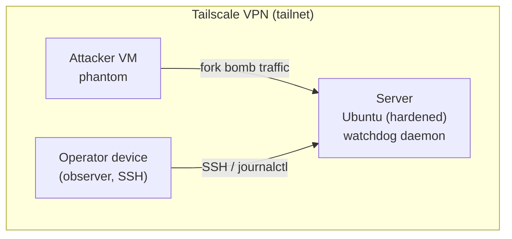

# Architecture overview

## System topology

## Nodes

**Server** — the target. Runs Ubuntu Server (hardened per `docs/infra/server-hardening.md`). The `watchdog` daemon runs as a native systemd service here. All OS algorithm execution happens on this machine.

**Attacker VM** — an isolated virtual machine with no outbound route to the public internet. Its only allowed connection is inward to the server through the Tailscale tailnet. Runs `phantom`, which launches a controlled fork bomb.

**Operator device** — any machine joined to the tailnet. Used to SSH into the server during the demo and observe logs in real time via `journalctl -u watchdog -f`. Not required for the system to function.

## Key design constraint

`watchdog` runs as a **native process** (systemd), not inside Docker. The algorithms it applies read directly from `/proc` and cgroup v2 filesystems. Running inside a container would abstract these away and break the educational purpose of the project.

Docker is present on the server only for the reverse proxy stack (`vps-proxy`), which is unrelated to this project's algorithms.

## Related docs

- [Data flow](data-flow.md)
- [Threat model](threat-model.md)
- [Tailscale setup](../infra/tailscale.md)
